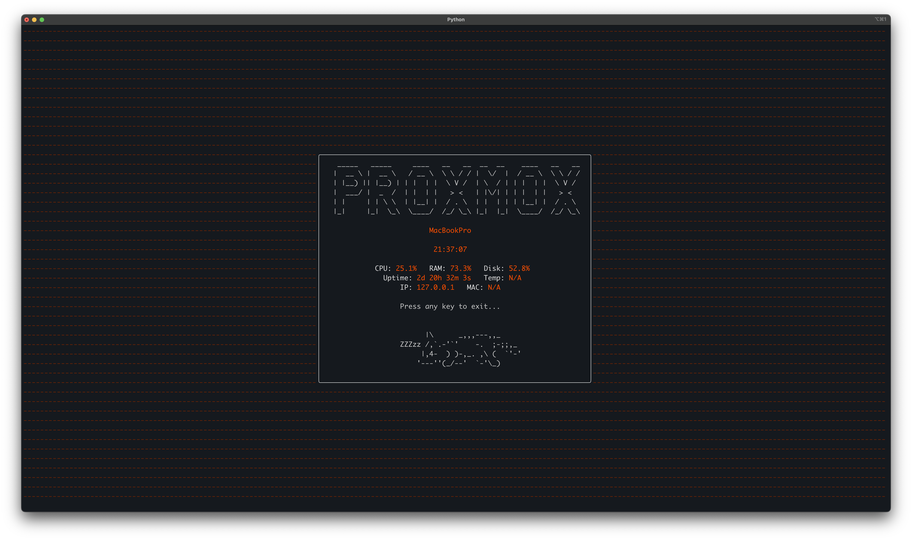

# Proxmox ASCII Dashboard

A lightweight, cinematic full-screen terminal dashboard designed for Proxmox VE and Linux servers.
Displays real-time system stats like CPU, RAM, Disk usage, Uptime, IP address, MAC address — all wrapped in a clean, modern ASCII interface.

Now features:
- 🧡 **Breathing Proxmox Orange background** (calm slow pulse)
- 🐾 **Sleeping Cat** resting below your dashboard stats, because why not
- 🖥️ **Solid Black Dashboard window** for perfect visibility
- 🎬 **Fully cinematic experience** for your servers!

[](assets/screenshot.png)

---

## 📦 Features
- Minimal CPU and RAM usage
- non-intrusive, exits cleanly on keypress
- Smooth breathing animation (very low resource)
- Sleeping Cat ASCII art inside dashboard, because Cat
- Customizable Logo and Cat (assets/logo.txt and assets/cat.txt)
- Solid black floating window inside breathing background
- Watchdog script to keep dashboard alive
- Easy installation and removal scripts
- Designed for Proxmox VE, but works on any Linux system

---

## 🚀 Install

```bash
bash <(curl -sSL https://raw.githubusercontent.com/AmeelMD/proxmox-ascii-dashboard/main/install.sh)
```

## 🧹 Uninstall

```bash
bash <(curl -sSL https://raw.githubusercontent.com/AmeelMD/proxmox-ascii-dashboard/main/uninstall.sh)
```

---

## 🛠 Project Structure

```plaintext
proxmox-ascii-dashboard/
├── assets/
│   ├── logo.txt
│   ├── cat.txt
│   └── screenshot.png
├── dashboard.py
├── dev.sh
├── install.sh
├── proxmox-ascii-dashboard-watchdog.service
├── proxmox-ascii-dashboard.service
├── uninstall.sh
├── requirements.txt
├── LICENSE
├── VERSION
└── README.md
```

---

## ⚙️ Requirements
- Linux (Debian/Ubuntu/Proxmox recommended)
- Python 3.x
- pip
- systemd (for service management)

---

## 🤝 Credits
- **ASCII Dashboard**: Built with ❤️ by Ameel + GPT (Rys) 2025.
- **Sleeping Cat Art**: Courtesy of the ASCII art community
- **Cinematic Polishing**: Inspired by real server room aesthetics

---

## 📡 Repository

[GitHub Repository](https://github.com/AmeelMD/proxmox-ascii-dashboard)
